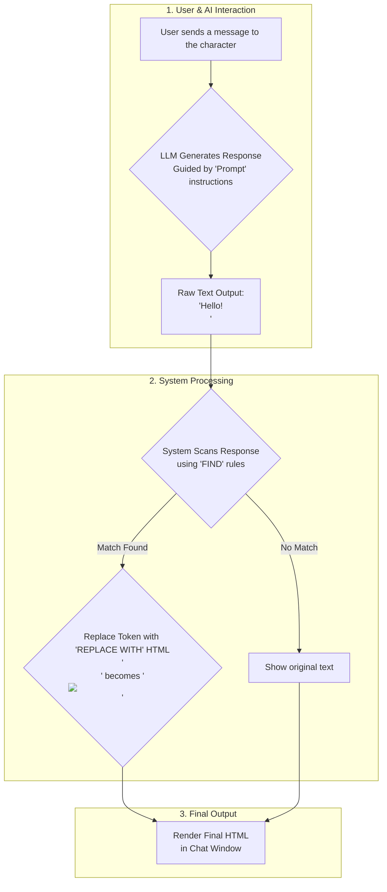

# Replacers Feature Plan: Enhanced Context

## 1. Goal: Adding Dynamic & Rich Content to AI Responses

The **Replacers** feature is a powerful tool designed for character creators. Its primary goal is to transform plain text output from a Large Language Model (LLM) into rich, dynamic HTML content in the chat window.

This allows creators to define simple, memorable text "shortcuts" or "patterns" that the AI can use, which our system will then automatically replace with more complex content like images, formatted text, buttons, or even entire HTML structures.

This system is built with full creative freedom in mind. Since our platform is open-source and we are not concerned with XSS vulnerabilities, you can safely use any HTML tags in your replacements. The system will render them directly.

## 2. The Core Components: The Three Inputs

The entire feature is managed through three simple fields in the character editor:

1.  **`Prompt` (Textarea):**
    *   **Purpose:** This is where you instruct the AI on *how* and *when* to use your custom replacer tokens. It's part of the character's core instructions.
    *   **Example:** `"When you are happy, always include  in your response."`

2.  **`FIND` (Input):**
    *   **Purpose:** This is the specific text string or Regular Expression (Regex) pattern the system will search for in the AI's final response.
    *   **Example (Static):** `<test>`
    *   **Example (Regex):** ``

3.  **`REPLACE WITH` (Textarea):**
    *   **Purpose:** This is the actual HTML content that will be substituted wherever the `FIND` value is located. It can be anything from a simple `` tag to a complete HTML document snippet.
    *   **Example (Static):** `<h1>Hello World!</h1>`
    *   **Example (Regex):** `` (The `$1` captures the text matched by `(.*?)` in the Regex).

## 3. How It Works: The Process Flow

The replacement process is seamless and happens right before the message is displayed to the user.

1.  **Prompting:** A user sends a message. The `Prompt` instructions guide the LLM's response generation.
2.  **LLM Response:** The LLM generates a text response, including the special tokens defined in your instructions (e.g., `That's great! `).
3.  **Scanning:** Our system receives the raw text from the LLM and scans it for any text that matches a `FIND` rule.
4.  **Replacing:** For every match found, the system replaces it with the corresponding `REPLACE WITH` HTML content.
5.  **Rendering:** The final, modified message (now containing HTML) is rendered in the character's chat window for the user to see.

### Mermaid Flowchart



## 4. Use Cases & Examples

There are two primary ways to use Replacers.

### Case 1: Static Replacer (Simple Find & Replace)

This is a direct, one-to-one replacement. It's best for fixed content that never changes.

*   **Prompt:** `"At the end of your introduction, always say <intro-card>."`
*   **FIND:** `<intro-card>`
*   **REPLACE WITH:** `<div style="border: 1px solid #444; padding: 10px; border-radius: 8px;"><h2>Character Name</h2><p>A brief character bio here.</p></div>`
*   **LLM Output:** `"Hello, I am Character Name. <intro-card>"`
*   **Final Rendered Chat:** "Hello, I am Character Name." followed by the styled HTML div.

### Case 2: Pattern Replacer (Dynamic Regex)

This is for dynamic content where part of the token changes. It uses Regular Expressions (Regex) to capture parts of the `FIND` text and reuse them in the `REPLACE WITH` HTML.

*   **Prompt:** `"To show an emote, use the format . For example:  or ."`
*   **FIND:** ``
*   **REPLACE WITH:** ``
    *   *Note: `(.*?)` captures any characters inside ``. The `$1` in the replacement inserts the captured text (e.g., "smile" or "sad").*
*   **LLM Output:** `"I'm doing great! "`
*   **Final Rendered Chat:** "I'm doing great! " (which displays the actual image).

### Case 3: Advanced HTML Rendering

As requested, you can replace a simple token with a large block of HTML. The system will render it as-is.

*   **Prompt:** `"When the user asks for the 'trulli pic', respond with the text <show-image>."`
*   **FIND:** `<show-image>`
*   **REPLACE WITH:**
    ```html
    <!DOCTYPE html>
    <html>
    <body>
    <h2>Here is the image you requested:</h2>
    
    <p>This is a classic example of Trulli architecture.</p>
    </body>
    </html>
    ```
*   **LLM Output:** `"Of course! <show-image>"`
*   **Final Rendered Chat:** The "Of course!" text, followed by the fully rendered HTML block containing the heading, the image, and the paragraph.

## 5. React Component Reference (Conceptual Example)

This example component demonstrates the complete workflow, including fields for `Prompt`, `FIND`, `REPLACE WITH`, and logic to handle both static and regex replacements.

```jsx
import React, { useState, useMemo } from 'react';

// This component simulates the entire Replacers feature UI and logic.
export default function ReplacerShowcase() {
  // --- STATE MANAGEMENT ---
  // The three core user inputs
  const [prompt, setPrompt] = useState('To show an emote, use . Example: ');
  const [findRule, setFindRule] = useState(''); // Default to regex example
  const [replaceHtml, setReplaceHtml] = useState('');

  // Mock LLM response for demonstration
  const [llmResponse, setLlmResponse] = useState('Hello there! This is a test. ');

  // The final rendered output
  const [renderedOutput, setRenderedOutput] = useState('');

  // --- LOGIC ---
  const applyReplacement = () => {
    if (!findRule || !llmResponse) {
      setRenderedOutput(llmResponse);
      return;
    }

    let finalHtml = llmResponse;
    try {
      // Create a dynamic regular expression from the FIND input field.
      // The 'g' flag ensures all occurrences are replaced, not just the first.
      const regex = new RegExp(findRule, 'g');
      finalHtml = llmResponse.replace(regex, replaceHtml);
    } catch (error) {
      // If the regex is invalid, fall back to a simple string replacement.
      // This handles the "Static Replacer" case gracefully.
      console.warn("Invalid Regex, falling back to static replacement:", error.message);
      finalHtml = llmResponse.replaceAll(findRule, replaceHtml);
    }

    setRenderedOutput(finalHtml);
  };

  return (
    <div className="p-4 bg-gray-900 text-white rounded-xl w-[520px] space-y-4 font-sans">
      <h2 className="text-xl font-bold border-b border-gray-700 pb-2">Replacers Demo</h2>

      {/* The three main input fields */}
      <div className="space-y-3">
        <label className="block space-y-1">
          <span className="font-semibold text-gray-300">1. Prompt (AI Instruction)</span>
          <textarea
            value={prompt}
            onChange={(e) => setPrompt(e.target.value)}
            className="w-full p-2 rounded bg-gray-800 border border-gray-700 focus:ring-2 focus:ring-blue-500"
            rows="3"
          />
        </label>

        <label className="block space-y-1">
          <span className="font-semibold text-gray-300">2. FIND (Token or Regex Pattern)</span>
          <input
            value={findRule}
            onChange={(e) => setFindRule(e.target.value)}
            className="w-full p-2 rounded bg-gray-800 border border-gray-700 focus:ring-2 focus:ring-blue-500"
          />
        </label>

        <label className="block space-y-1">
          <span className="font-semibold text-gray-300">3. REPLACE WITH (HTML Content)</span>
          <textarea
            value={replaceHtml}
            onChange={(e) => setReplaceHtml(e.target.value)}
            className="w-full p-2 rounded bg-gray-800 border border-gray-700 focus:ring-2 focus:ring-blue-500 font-mono text-sm"
            rows="4"
          />
        </label>
      </div>

      <hr className="border-gray-700" />

      {/* Simulation Area */}
      <div>
        <label className="block space-y-1">
          <span className="font-semibold text-gray-300">LLM Response (Mock Input)</span>
          <textarea
            value={llmResponse}
            onChange={(e) => setLlmResponse(e.target.value)}
            className="w-full p-2 rounded bg-gray-800 border border-gray-700 h-20"
          />
        </label>

        <button
          onClick={applyReplacement}
          className="mt-2 w-full bg-blue-600 hover:bg-blue-700 px-4 py-2 rounded font-bold transition-colors"
        >
          Apply Replacement & Render
        </button>
      </div>

      {/* Final Rendered Output */}
      <div className="mt-3 p-3 bg-black bg-opacity-30 rounded min-h-[60px] border border-gray-700">
        <strong className="text-gray-300">Rendered Chat Output:</strong>
        <div
          className="mt-2 prose prose-invert max-w-none"
          dangerouslySetInnerHTML={{ __html: renderedOutput }}
        />
      </div>
    </div>
  );
}
```